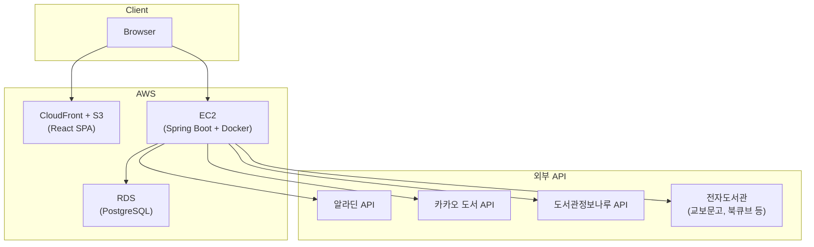
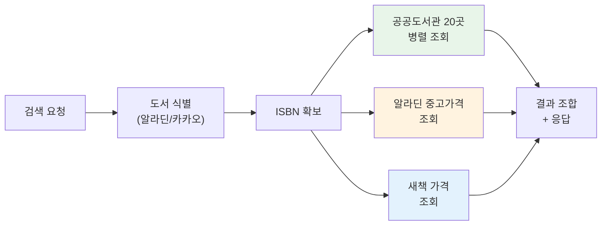
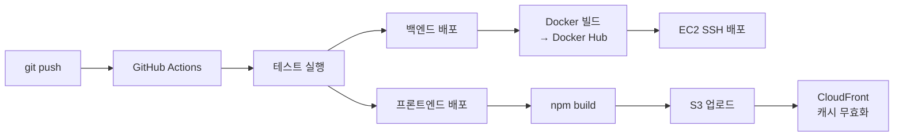

# CheckBook - 도서 통합 검색 서비스

> 읽고 싶은 책의 도서관 소장 현황, 중고 가격, 전자도서관 대출 가능 여부를 한 번에 확인할 수 있는 서비스입니다. 여러 사이트를 따로 확인해야 하는 번거로움을 없애고자 개발했습니다.
>
> https://checkbook.kr

<br>

## 기술 스택

<div>
  
  
  
  
  
</div>
<div>
  
  
  
  
</div>
<div>
  
  
  
  
  
  
</div>

<br>

## 서비스 화면

| 메인 | 검색 결과 |
|:---:|:---:|
| <!-- TODO: main_page.png URL --> | <!-- TODO: search_page.png URL --> |

| 상세 - 공공도서관 | 상세 - 중고/전자도서관 |
|:---:|:---:|
| <!-- TODO: detail_page1.png URL --> | <!-- TODO: detail_page2.png URL --> |

<br>

## 주요 기능

- **도서 식별** - 제목, 저자, ISBN으로 검색하면 알라딘/카카오 API를 통해 정확한 도서를 식별
- **공공도서관 소장/대출 현황** - 사용자 위치 기반으로 가까운 공공도서관 20곳의 소장 여부와 대출 가능 여부를 실시간 조회
- **중고 도서 가격 비교** - 알라딘 중고 3개 채널(개인판매, 온라인, 매장)의 최저가를 한눈에 비교
- **전자도서관 대출 가능 여부** - 선택한 전자도서관에서 해당 도서의 대출 가능 여부를 실시간 검색

<br>

## 아키텍처

### 시스템 구조



### 검색 처리 흐름

하나의 검색 요청이 들어오면 여러 외부 소스를 **병렬로** 호출하여 2.8초 내에 응답합니다.



### 배포 파이프라인



<br>

## 설계 결정

| 항목 | 결정 | 이유 |
|---|---|---|
| 공공도서관 조회 | 실시간 API 호출 | 대출 가능 여부는 실시간 상태이므로 캐싱 불가 |
| 전자도서관 조회 | 실시간 크롤링 | 공식 API 미제공, 대출 상태도 실시간 확인 필요 |
| 검색 타임아웃 | 2.8초 데드라인 | 응답 지연 시 도착한 결과까지만 반환 (graceful degradation) |
| 위치 정보 | 브라우저 Geolocation | 공공도서관 거리순 정렬에 필요, 미허용 시 기능 제한 안내 |
| DB 마이그레이션 | Flyway | JPA ddl-auto 대신 SQL 기반 버전 관리 |
| 외부 API 장애 대응 | Resilience4j Circuit Breaker | 도서관정보나루 API 장애 시 연쇄 실패 방지 |
| 프론트/백 분리 배포 | S3+CloudFront / EC2+Docker | 정적 자원과 API 서버의 스케일링 독립 |

<br>

## 패키지 구조

```
src/main/java/com/checkbook/
├── client/                          # 외부 API 클라이언트
│   ├── aladin/                      #   알라딘 (도서 식별, 중고가격)
│   ├── datanaru/                    #   도서관정보나루 (공공도서관 소장/대출)
│   └── kakao/                       #   카카오 (도서 식별 보조)
├── search/                          # 통합 검색 (오케스트레이터)
│   ├── controller/
│   ├── service/
│   └── dto/
├── publiclibrary/                   # 공공도서관 도메인
│   ├── domain/
│   ├── repository/
│   ├── service/
│   └── snapshot/                    #   소장/대출 스냅샷 캐시
├── elibrary/                        # 전자도서관 도메인
│   ├── client/                      #   교보문고, 북큐브 크롤링 클라이언트
│   ├── domain/
│   ├── service/
│   └── controller/
├── aladinstore/                     # 알라딘 중고매장 도메인
│   ├── domain/
│   └── repository/
└── common/                          # 공통 (예외, 유틸, 설정)
```

<br>

## 테스트

28개 테스트 클래스, MockWebServer 기반 외부 API 테스트 포함.

```bash
./gradlew test
```

<br>

## 마주했던 문제와 결정

- [전자도서관 실시간 크롤링 vs 사전 캐싱 비교](notes/decisions/2026-04-15-전자도서관-크롤링-vs-사전캐싱.md)
- [AladinBookService 추출 — 서비스 구조 설계 결정](notes/decisions/2026-04-08-알라딘-서비스-추출-구조-결정.md)
