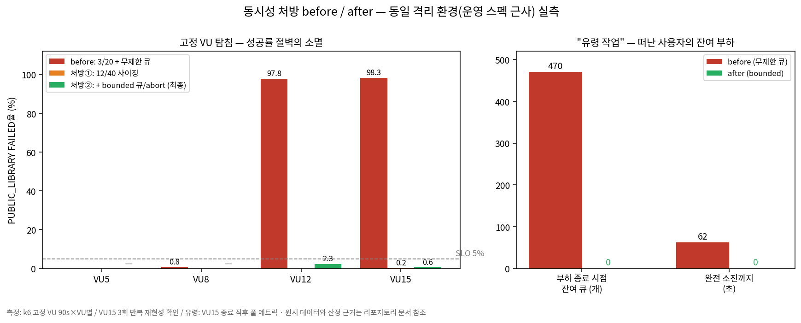

# CheckBook - 도서 통합 검색 서비스

> 읽고 싶은 책의 도서관 소장 현황, 중고 가격, 전자도서관 대출 가능 여부를 한 번에 확인할 수 있는 서비스입니다. 여러 사이트를 따로 확인해야 하는 번거로움을 없애고자 개발했습니다.
>
> https://checkbook.site

<br>

## 서비스 화면

| 메인 | 검색 결과 |
|:---:|:---:|
|  |  |

| 상세 - 공공도서관 | 상세 - 중고/전자도서관 |
|:---:|:---:|
|  |  |

<br>

## 주요 기능

- **도서 식별** — 제목, 저자, ISBN으로 검색하면 알라딘/카카오 API를 통해 정확한 도서를 식별
- **공공도서관 소장/대출 현황** — 사용자 위치 기반으로 가까운 공공도서관을 5곳씩(더보기로 최대 20곳) 조회해 소장 여부와 대출 가능 여부를 실시간 확인
- **중고 도서 가격 비교** — 알라딘 중고 3개 채널(개인판매, 온라인, 매장)의 최저가를 한눈에 비교
- **전자도서관 대출 가능 여부** — 선택한 전자도서관에서 해당 도서의 대출 가능 여부를 실시간 검색

<br>

## Tech Stack

### Frontend


### Backend


### Infra


<br>

## 아키텍처

### 시스템 구조


### 검색 처리 흐름

하나의 검색 요청이 들어오면 여러 외부 소스를 **병렬로** 호출하여 2.8초 내에 응답합니다.


### 배포 파이프라인


<br>

## 설계 결정

| 항목 | 결정 | 이유 |
|---|---|---|
| 공공도서관 조회 | 실시간 API 호출 | 대출 가능 여부는 실시간 상태이므로 캐싱 불가 |
| 전자도서관 조회 | 실시간 크롤링 | 공식 API 미제공, 대출 상태도 실시간 확인 필요 |
| 검색 타임아웃 | 2.8초 데드라인 | 응답 지연 시 도착한 결과까지만 반환 (graceful degradation) |
| 외부 API 장애 대응 | Resilience4j Circuit Breaker | 도서관정보나루 API 장애 시 연쇄 실패 방지 |
| DB 마이그레이션 | Flyway | JPA ddl-auto 대신 SQL 기반 버전 관리 |
| 프론트/백 분리 배포 | S3+CloudFront / EC2+Docker | 정적 자원과 API 서버의 스케일링 독립 |
| 스레드풀 사이징 | 3-tier 분리, 12/40/5 | 공유 풀은 중첩 fan-out에서 데드락형 기아(재현 테스트로 증명). 크기는 "동시 요청 × 요청당 태스크"로 산정 후 부하 실측으로 검증 |
| 실행자 큐 | bounded + AbortPolicy | 무제한 큐는 데드라인 지난 "유령 작업"을 적체(실측: 부하 종료 후 62초 점유). 큐 용량은 윈도 산식, 거절 정책은 A/B 실측으로 확정 |
| 종료 처리 | @PreDestroy 블로킹 drain | SIGTERM 경로에서 진행 중 작업 보호는 daemon 여부가 아니라 awaitTermination 예산(5s)이 담당 |

<br>

## 패키지 구조

```
src/main/java/com/checkbook/
├── client/                          # 외부 API 클라이언트
│   ├── aladin/                      #   알라딘 (도서 식별, 중고가격)
│   ├── datanaru/                    #   도서관정보나루 (공공도서관 소장/대출)
│   └── kakao/                       #   카카오 (도서 식별 보조)
├── search/                          # 통합 검색 (오케스트레이터)
│   ├── controller/
│   ├── service/
│   └── dto/
├── publiclibrary/                   # 공공도서관 도메인
│   ├── domain/
│   ├── repository/
│   ├── service/
│   └── snapshot/                    #   소장/대출 스냅샷 캐시
├── elibrary/                        # 전자도서관 도메인
│   ├── client/                      #   교보문고, 북큐브 크롤링 클라이언트
│   ├── domain/
│   ├── service/
│   └── controller/
├── aladinstore/                     # 알라딘 중고매장 도메인
│   ├── domain/
│   └── repository/
└── common/                          # 공통 (예외, 유틸, 설정)
```

<br>

## 테스트

43개 테스트 클래스 (기본 스위트 41 + 동시성 재현 2), MockWebServer 기반 외부 API 테스트 포함.

```bash
./gradlew test            # 기본 스위트 (결정적 테스트만)
./gradlew diagnosisTest   # 동시성 한계 재현 테스트 (타이밍 의존이라 분리 태깅)
```

<br>

## 동시성 한계 — 측정으로 찾고, 측정으로 고치기 (2026-07)

검색 1건이 외부 소스들로 병렬 fan-out하는 구조에서 "동시 사용자가 늘면?"에 답하기 위해,
**가설 박제 → 계측 → 부하 재현 → 진단 → 처방 → 재측정**의 사이클을 돌렸다.
측정 환경은 운영 스펙(2vCPU/1GB)을 근사한 격리 compose + 실측 분포로 캘리브레이션한 WireMock.



| 발견한 문제 (실측) | 처방 | 검증 결과 |
|---|---|---|
| 풀이 동시 요청 1건 기준으로 사이징돼 동시 9~11명에서 성공률 절벽 (FAILED 0.8%→97.8%) — 병목은 가설(fan-out 풀)과 달리 상위 오케스트레이션 풀 | ① 사이징 재산정 3/20→12/40 (동시 요청 × 요청당 태스크) | VU12 97.8%→0% (p95 2.46s, SLO 충족). VU15도 FAILED 0.2% (p95 3.31s로 지연 축은 경계) |
| 무제한 큐가 데드라인 지난 "유령 작업"을 적체 — 부하 종료 후에도 큐 470개, 62초간 풀 점유 | ② bounded 큐 + 명시적 거절(abort) | 종료 시점 큐 0, 소진 0초. 용량 초과 유입(open-loop 15rps)에서도 발산 없이 셰딩 |
| 거절 정책 논쟁(abort vs callerRuns)은 코드 논증으로 결정 불가 | 정책을 프로퍼티 주입으로 만들어 장애 주입 A/B 실측 | abort: FAILED 0.05% vs callerRuns: 15.8%·max 41.5s — abort 확정 |
| 1차 큐 용량(40)이 정상 부하에서 도서관 스킵 85%를 유발 — FAILED·latency 지표로는 보이지 않는 조용한 데이터 유실 | 큐 용량을 윈도 산식으로 재산정: (윈도 2.2s − 처리 p50 0.36s) × 소화속도 ≈ 200 | 스킵 85.3%→0.21%, 유령 0 유지 |

과정에서 지킨 것: 측정 전 가설을 커밋 해시와 함께 박제(예측이 틀린 부분도 기록),
처방은 비용 오름차순으로 하나씩 적용하며 사이마다 재측정(변인 통제),
측정 도구 자체의 결함(모의 서버 스레드 포화 등)을 검증해 오염된 수치는 폐기 후 전면 재측정.

<br>

## 마주했던 문제와 결정

- [전자도서관 실시간 크롤링 vs 사전 캐싱 비교](notes/decisions/2026-04-15-전자도서관-크롤링-vs-사전캐싱.md)
- [AladinBookService 추출 — 서비스 구조 설계 결정](notes/decisions/2026-04-08-알라딘-서비스-추출-구조-결정.md)
